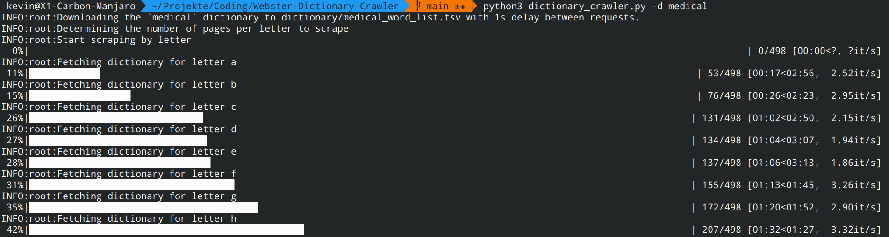

# Webster Dictionary Crawler
Tool to get a list of all words in the Merriam Webster dictionary or special sub-categories e.g. medical dictionary.

## Installation
> Requirements:
> - Python 3.8 or higher

1. Clone the repository and enter the downloaded directory
```shell
git clone https://github.com/kevihiiin/Webster-Dictionary-Crawler.git && cd Webster-Dictionary-Crawler
```
2. Install the required python packagse
```shell
pip -r requirements.txt
```

## Usage
By default the script grabs all words starting with [A-Za-z0-9] from the specified dictionary and
writes the output word list to `dictionary/{dictionary}_word_list.tsv`.

The user has to specify which dictionary to download from, either `medical` or `dictionary` for the standard one.

Example 1:
- Download the `medical` dictionary (save to default location)
```shell
python3 dictionary_crawler.py --dictionary medical
```

Example 2:
- Download the `medical` dictionary
- Save the output to `my_word_list.tsv`
- Wait 2s between requests

```shell
python3 dictionary_crawler.py -d medical -o my_word_list.tsv -w 2
```


Full usage page:
```shell
usage: dictionary_crawler.py [-h] -d dictionary_name [-o output_file] [-w delay_s] [-v verbosity]

Download all words from the Merriam-Webster dictionary

options:
  -h, --help            show this help message and exit
  -d dictionary_name, --dictionary dictionary_name
                        Dictionary to download, `medical` or the standard `dictionary`
  -o output_file, --output output_file
                        Path to the output file
  -w delay_s, --wait delay_s
                        Delay added between requests in seconds
  -v verbosity, --verbosity verbosity
                        Verbosity of the logger
```

## Output and Screenshots
The output file contains one word per line, alphabetically sorted.
```
Word 1
Word 2
Word 3
...
```
Screenshot of the running terminal

## Notes
If you require definitions, examples, etymologies etc please refer to the official 
Merriam-Webster [API](https://dictionaryapi.com/products/index). You can use this tool to get all the words in the dictionary and look the definitions up using the official API.

Please check the Merriam-Webster T&C on how the word list data may be used.
